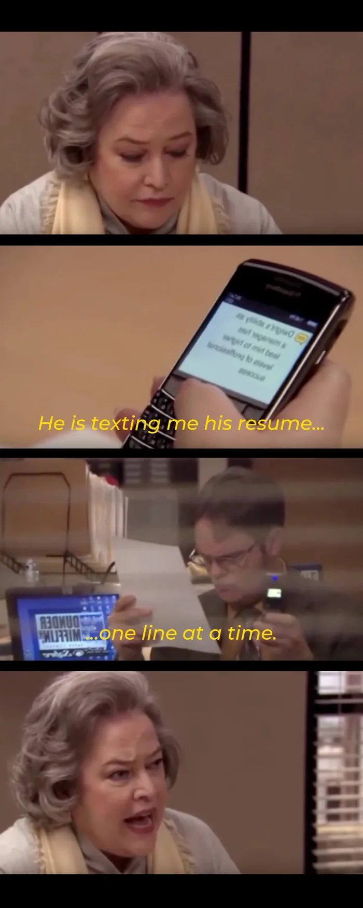

# One Line at a Time

<p align="center">

</p>

## Introduction
One-line-at-a-time was a hobby project inspired by the character Dwight K. Schrute of 'The Office'. His efficient usage of text to deliver his resume is now replicated in this project. Using Twilio messaging system users can subscribe to receive documents one line at a time to their phone.

---
## Getting Started
Sign up for a developer account on https://www.twilio.com/ 


```shell
git clone git@github.com:EmFord/one-line-at-a-time.git

cd on-line-at-a-time

go build -o one-line-a-at-time
```

---
## Usage

```shell
export TWILIO_ACCOUNT_SID="<SID-FROM-ACCOUNT>"
export TWILIO_AUTH_TOKEN="<AUTH-TOKEN-FROM-ACCOUNT>"
export TWILIO_FROM_PHONE_NUMBER="<NUMBER-CREATED-FROM-ACCOUNT>"

./one-line-a-at-time RECEIVER_PHONE_NUMBER
```

---
## Future Work

- [ ] Allow upload of any document
- [ ] Build server
- [ ] Subscribers


 
 